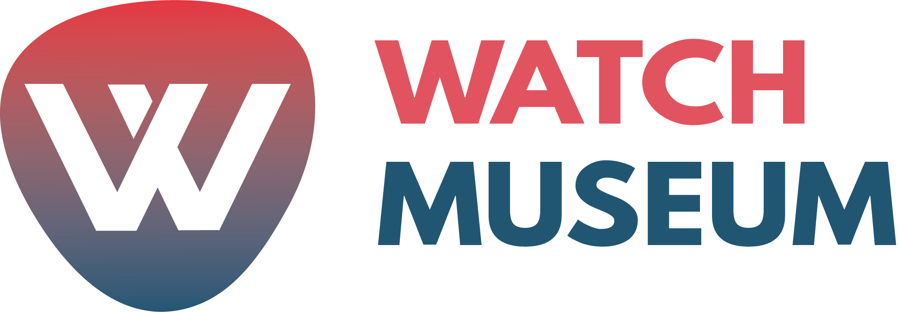

  

    FrontEnd do aplicativo mobile para gerenciamento de Museu's

 <a href="#status">Status</a> • 
 <a href="#objetivo">Objetivo</a> •
 <a href="#instalacao">Instalação</a> • 
 <a href="#tecnologias">Tecnologias</a> • 
 <a href="#autor">Autor</a> • 
 <a href="#licenca">Licença</a> 

<h2 align="center" id=status> 
	:star: Concluído :star:
</h2>

<h2 id=objetivo>:scroll: Objetivo</h2>

Este projeto tem como objetivo construir um frontend para o app mobile utilizando React Native para consumir os dados de API' e renderizá-las na tela. 
É feito um sistema que verifica os dados de 03 salas do museu e informa sua umidade e temperatura. 
Ele alerta caso a umidade fique acima de 70% (regra de negócio).
E possui o histórico da média da temperatura dos últimos 10 dias.

<h2 id=instalacao>:clipboard: Instalação</h2>

1. Faça o clone do repositório.
2. Acesse o repositório dos códigos em Python: 
[Watch Museum BackEnd - Python](https://github.com/danhpaiva/watch-museum-py) 
Clone o repositório. E Execute os arquivos. 
3. Instale o APK.

<h2 id=tecnologias>:toolbox: Tecnologias</h2>

As seguintes ferramentas foram usadas na construção do projeto:

- IDE: <a href="https://code.visualstudio.com/">Visual Studio Code</a>
- Python 3.7.9 - <a href="https://www.python.org/downloads/release/python-379/"> Download </a>
- Banco de Dados Remoto: <a href="https://thingspeak.com/">ThingSpeak</a>
- Banco de Dados Local: <a href="https://www.sqlite.org/download.html">SQLite 3</a>
- React Native - <a href="https://reactnative.dev/"> Download </a>

<h2 id=autor>:grin: Autores</h2>

Desenvolvido por <a href="https://www.linkedin.com/in/danhpaiva/" target="_blank">Daniel Paiva</a>,
<a href="https://www.linkedin.com/in/francisco-fontoura/" target="_blank">Francisco Fontoura</a>,
<a href="https://github.com/gab-gomes" target="_blank">Gabriel Gomes</a> e 
<a href="https://www.linkedin.com/in/guilhermepujoni/" target="_blank">Guilherme Pujoni</a> .

<h2 id=licenca>:lock: Licença</h2>
<a href="https://github.com/danhpaiva/login-csharp-sqlServer/blob/master/LICENSE" target="_blank">MIT</a>
